### 1.安装 ###

###### 下载 ######

打开[PyCharm](https://www.jetbrains.com/pycharm/)官网，选择专业版 下载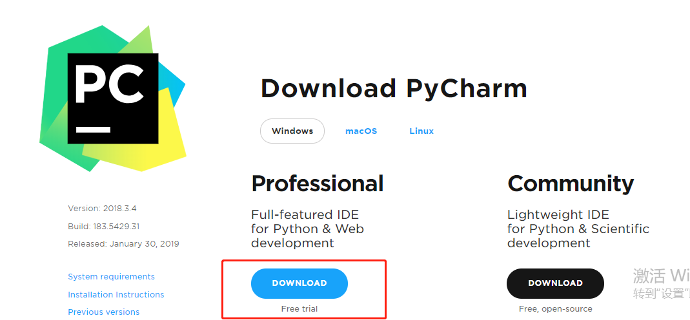
==逼可以装的不好，但是一定要专业==

###### 安装  ######

选择非C盘路径 一路确定

###### 破解 ######

1. ==注意：先别打开PyCharm==
2. 修改host文件 
   Win下找到HOST目录，一般`C:\Windows\System32\drivers\etc`   记事本打开 最后一行增加`0.0.0.0 account.jetbrains.com`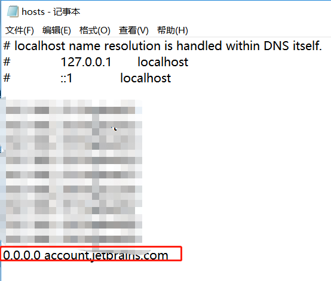
3. 打开`http://idea.lanyus.com/` 复制注册码
   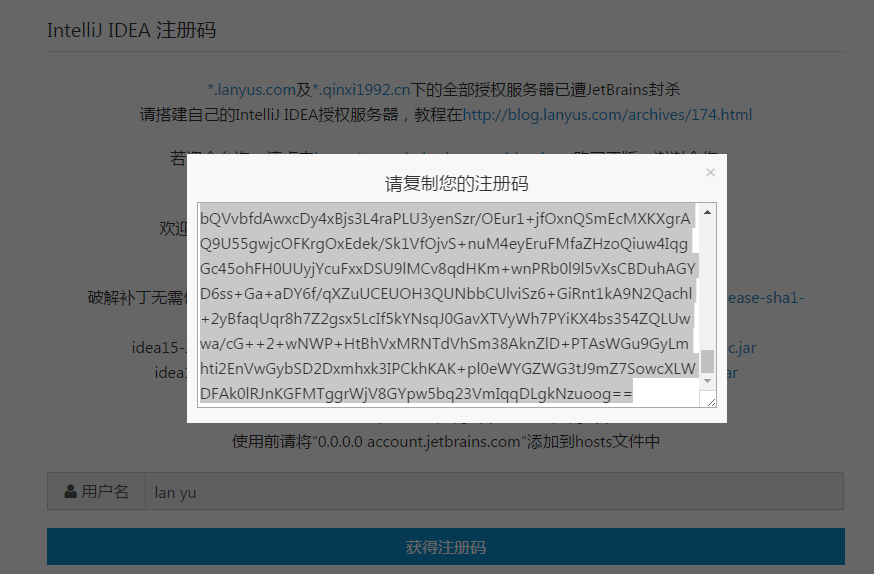
4. 打开PyCharm   输入注册码   目前激活码截止2019年5月过期 还剩几个月时间
    
### 2.常设配置（*可选） ###

工欲善其事必先利其器

###### 字体、主题 ######

字体、主题基本操作  全凭个人喜好 也可以网上下载制作的主题
下面是我常用配置 
`Settings > Appearance > Theme > Darcula`
Settiings >  Font >  Font : Consonlas;Size:18 

之后是一些不常见小tips ，但能提高效率

###### 快捷键 ######

`Settings > Keymap`  默认`Defalut`
熟悉Eclipse的可下拉选择Eclipse

- **修改热键**

  PyCharm提供了可修改快捷键的功能
  常用功能RUN的自带快捷键Alt+Shift+F10 真是生痛恶觉
  自定义修改为Ctrl+B^SublimeText常用啊^

  搜索框搜索RUN 找到RUN功能点 Add KeyBoard ShortCut

  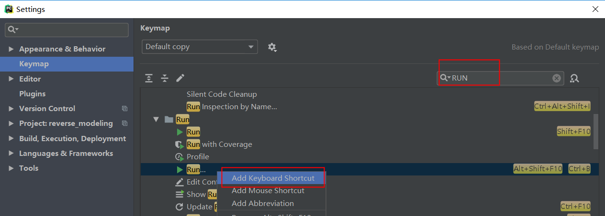

###### ToolBar ######

打开`ToolBar` 顶部菜单栏还是非常实用的
View > ToolBar

###### 远程同步

专业版才能有的功能
Tools > Deployment > Configuration 点击`+`  新建服务器名 填写相关信息

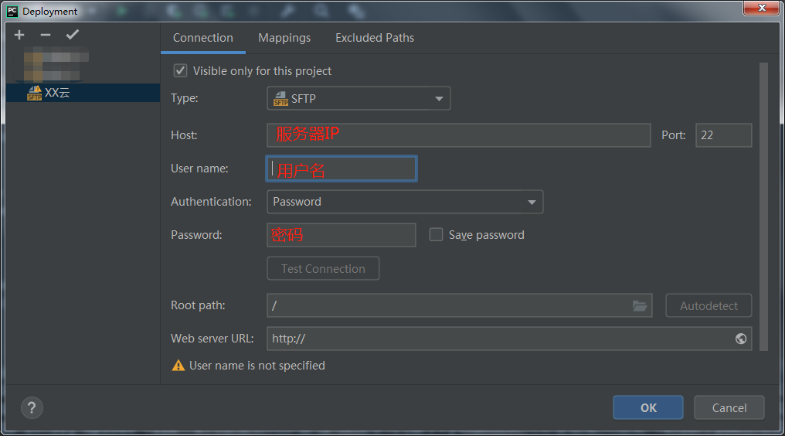
设置成功后 即可与服务器同步  有Upload(Automatic)、Download、Compare
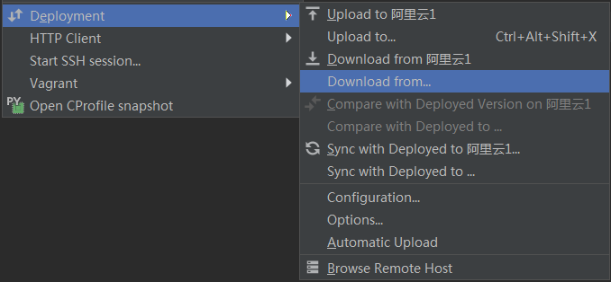

###### 远程调试

==若启用远程调试 则无需上述远程同步步骤==
==远程调试已包含远程同步==

Settings > Project Interpreter > Add 
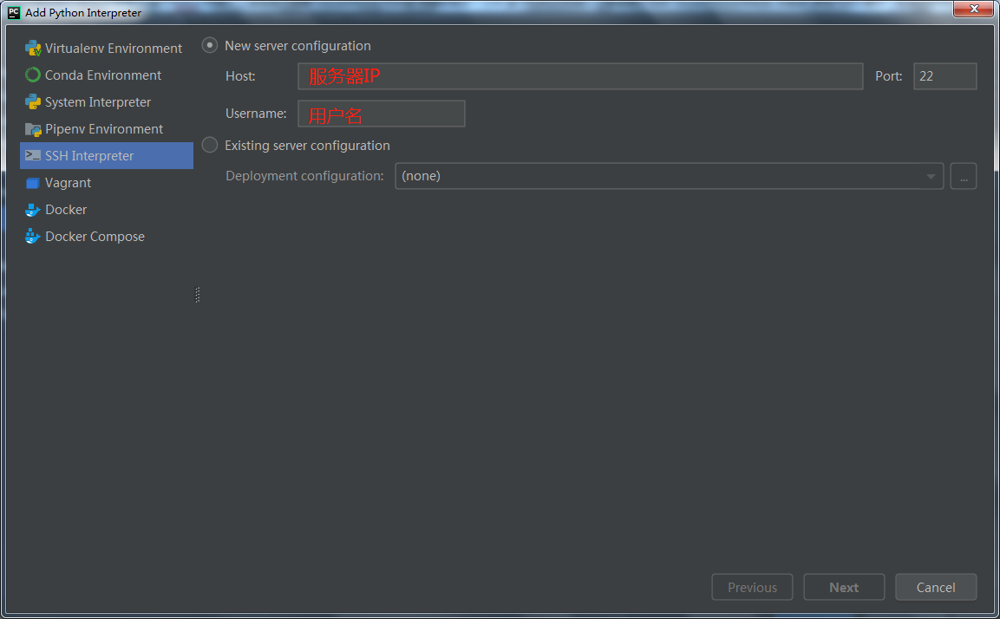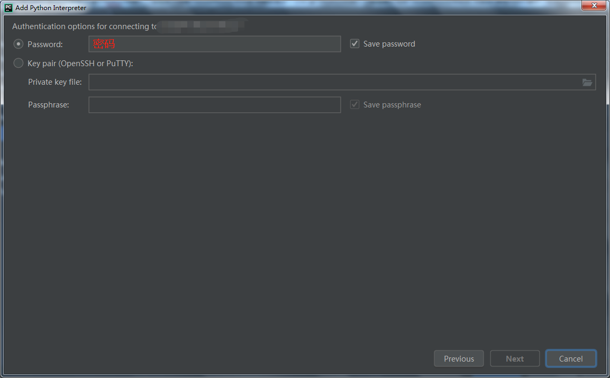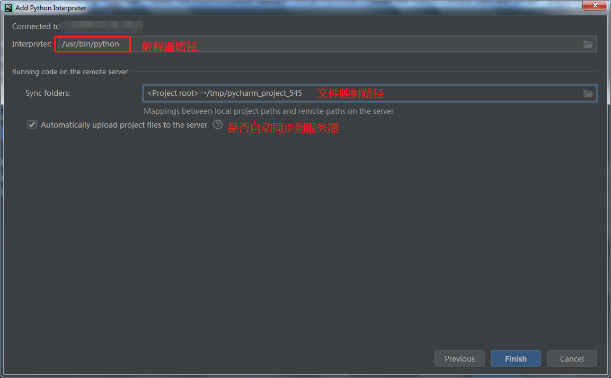
配置完毕 即可选择服务器端的解释器进行调试

###### PEP8规范 ######

作为一个优雅的程序员 岂能忍受满屏的波浪线
之所以出现波浪线的原因是 
敲的代码多多少少有些不符合PEP8规范
PyCharm会自动检查是否符合PEP8规范
可以在设置中关闭自动检查
这里当然不会关闭检查 掩耳盗铃的事咱不干  
既然不符合 就让自己的代码符合

1. 下载自动PEP8规范插件  命令行

   ```
   pip install autopep8
   ```

2. Pycharm配置
   Settings > Tools > Extends Tools > 点击加号

3. 填写配置项
   Name: Autopep8
   Program:python的安装目录的Scripts\autopep8.exe
   Arguments:--in-place --aggressive $FilePath$
   或者-in-place --aggressive  --ignore=E123,E133,E50 $FilePath​$[忽略E123,E133,E50这三条小规则]
   Working directory:\$ProjectFileDir​$
   Output filters:\$FILE_PATH\$\:\$LINE\$\:\$COLUMN\$\:.*
   点击OK!

   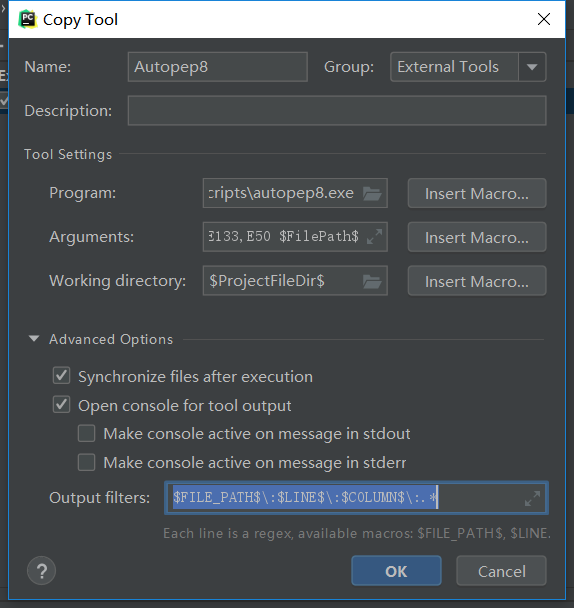

4. py文件右键 选择Autopep8
   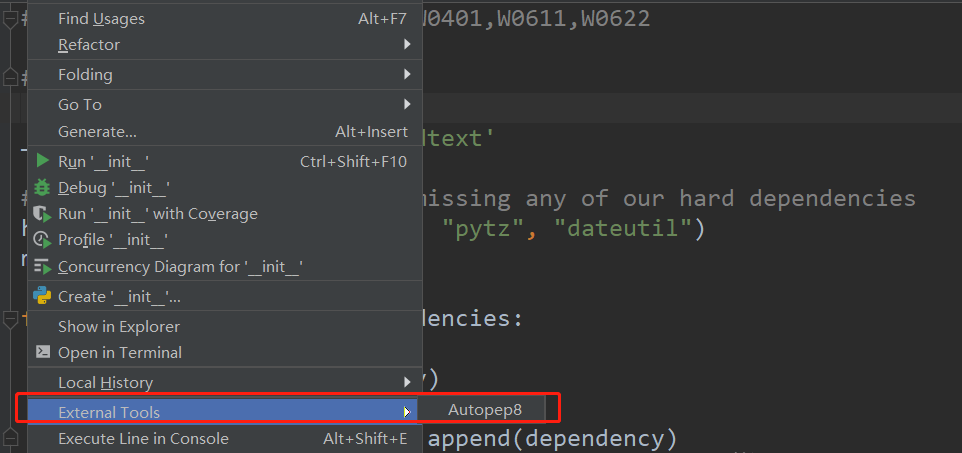


######  
